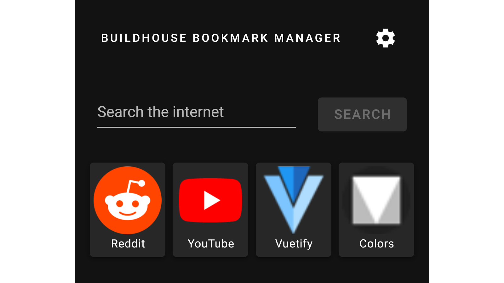

# Buildhouse Bookmark Manager (client)

The Buildhouse Bookmark Manager PWA client. My dad was frustrated with the bookmarks on the homescreens of some browsers on his phone and asked me if I could whip something up.

The main screen of the app contains all the saved bookmarks and a search bar to search on the internet. All the bookmarks are stored on a server so that the bookmarks can be accessed from anywhere. The client is publicly hosted on my [site](https://bbm.pascalbouwhuis.nl/). Sadly, I can't guarantee a 100% uptime, so feel free to host it yourself.
You do need to host your own server. The server can be found in the [Gabbersaurus/buildhouse-bookmarkmanager-server](https://github.com/Gabbersaurus/buildhouse-bookmarkmanager-server) repository

## Connecting with a server

The app starts out on the login screen, as can be seen in the following image:

In the `server` field, fill in the Buildhouse Bookmark Manager server URL. Make sure to add the `http` or `https` protocol and port.
Fill in the credentials of the user you want to connect as and press `authenticate`. You should now be connected with the server and able to see the saved bookmarks.

## Settings

The button to open the settings can be found on the top right of the main screen. This opens the settings dialog, as can be seen in the following image:

In here, the bookmarks can be managed, the search provider can be set, the favicons can be reloaded and the user can log out.
The name and url of a bookmark can be editted by pressing the field in the table. The bookmark can be sorted and deleted with the buttons.
The following search providers are currently added:

-   DuckDuckGo
-   Google
-   Ecosia
-   Bing

## Installation and running for self-host

-   Run `yarn install` to install packages.
-   To start the dev server, run `yarn serve`.
-   To build, run `yarn build`. The build can be hosted in any static file server.
    -   Sadly, `@vue/cli-plugin-pwa` doesn't apply the PWA scope in the `manifest.json`. To make sure that the bookmarks are opened outside of the PWA, add `scope: '/'` to the `manifest.json` of the build.
